

  

 

# DRH - Object Layout Studio
### Public Support Hub · Documentation · Feedback · Pending Review

**Align, distribute, arrange, orient, register, ground, quantize, and transform objects with precision.**

 

**Part of the DRH Add-ons ecosystem - Blender tools, updates, and releases.**

---

**DRH - Object Layout Studio** helps Blender users align, distribute, arrange, move, rotate, orient, register, ground, quantize, and position objects through repeatable layout and geometry-aware workflows.

**Complete and Lite have both been submitted and are currently awaiting provider approval.**

This repository is the central public hub for support, documentation, issue tracking, compatibility feedback, release-review feedback, and future release notes for both editions.

---

## Support DRH Development

If **DRH - Object Layout Studio** helps you work faster or makes your Blender workflow more reliable, you can support ongoing DRH development on **Ko-fi**. Your contribution helps fund maintenance, Blender compatibility updates, documentation, testing, and the development of new production-focused tools across the DRH ecosystem. Support is completely optional, and bug reports, compatibility feedback, and workflow suggestions are always welcome.

  

[**Support DRH on Ko-fi**](https://ko-fi.com/pacosalasv)

---

  
<strong>📚 Table of Contents</strong>

## Menu

- [Overview](#overview)
- [Editions](#editions)
- [Media preview](#media-preview)
- [What DRH - Object Layout Studio does](#what-drh---object-layout-studio-does)
- [Key features](#key-features)
- [Full feature list](#full-feature-list)
- [Who is it for?](#who-is-it-for)
- [Current status](#current-status)
- [Feedback and compatibility reports](#feedback-and-compatibility-reports)
- [Quick links](#quick-links)
- [Before you post](#before-you-post)
- [Use Discussions for](#use-discussions-for)
- [Use Issues for](#use-issues-for)
- [Where to post](#where-to-post)
- [Support policy](#support-policy)
- [Technical notes](#technical-notes)
- [Availability](#availability)
- [Documentation](#documentation)
- [LICENSE](#LICENSE)

---

## Overview

**DRH - Object Layout Studio** is a Blender workflow utility designed to make object alignment, distribution, arrangement, transform matching, geometric alignment, registration, and precision placement faster and more repeatable.

The product is available in two editions:

- **Complete - DRH - Object Layout Studio:** Align, Transform, Advanced, and Utility.
- **Lite - DRH - Object Layout Studio Lite:** Align and Transform only.

The editions use separate extension IDs and can be installed independently. When Complete and Lite are enabled at the same time, both editions display a warning that the Complete edition is active and recommend disabling Lite to avoid duplicate tools.

## Editions

| Complete | Lite |
|---|---|
| 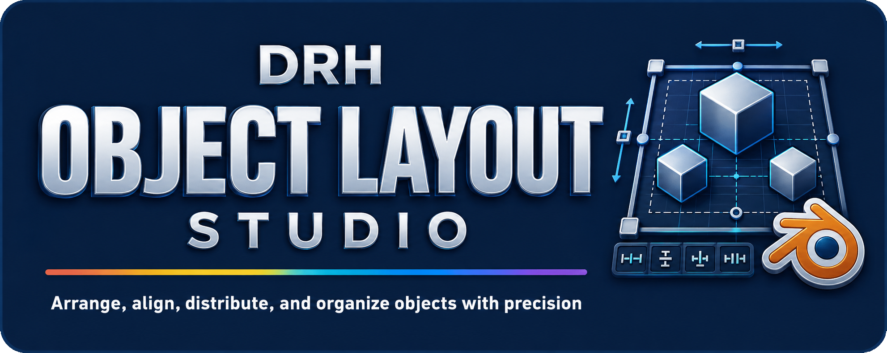 | 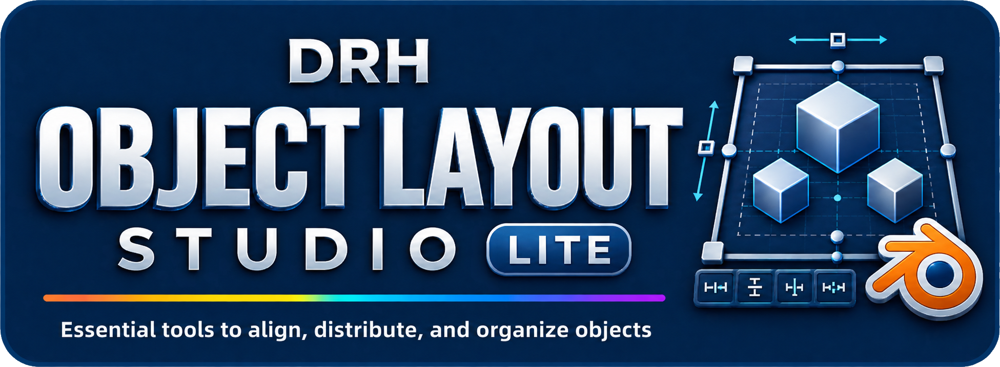 |
| Align · Transform · Advanced · Utility | Align · Transform |
| 🟡 **Pending Review** | 🟡 **Pending Review** |

Both editions are in provider review for the 1.0.0 release. The support repository remains shared so documentation, issue tracking, compatibility information, and release notes stay in one place.

---

## Media preview

The screenshots below reflect the submitted 1.0.0 interface and are organized by workflow area.

### Core layout workflows

| Align | Transform |
|---|---|
| 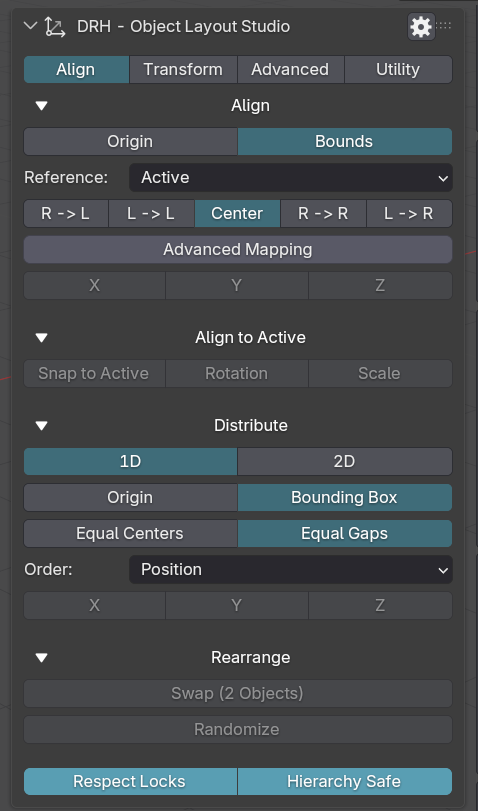 | 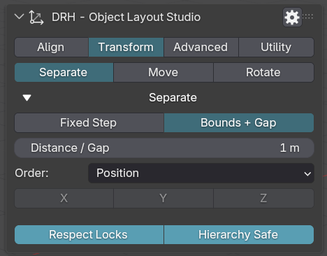 |

### Advanced workflows — Complete edition

| Advanced overview | Active Reference, View Align, and Auto Orient |
|---|---|
| 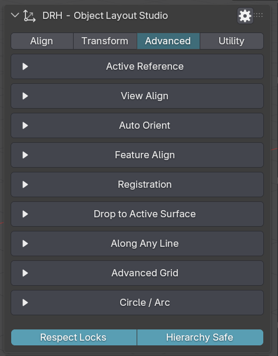 | 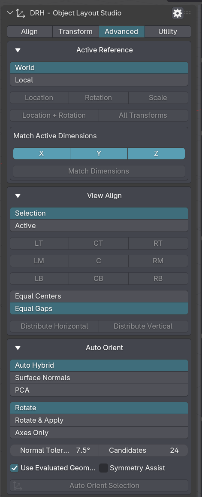 |
| Feature Align, Registration, and Surface | Along Any Line, Advanced Grid, and Circle or Arc |
| 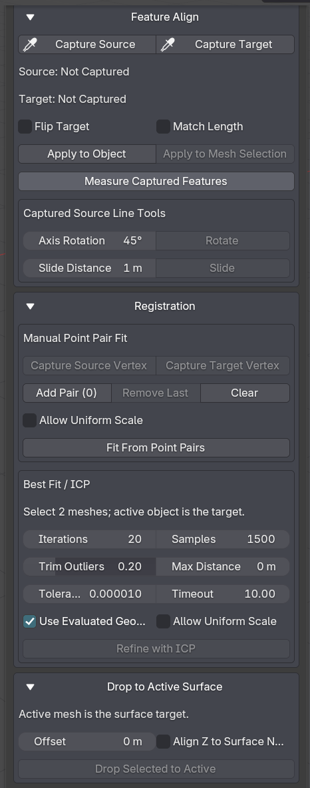 | 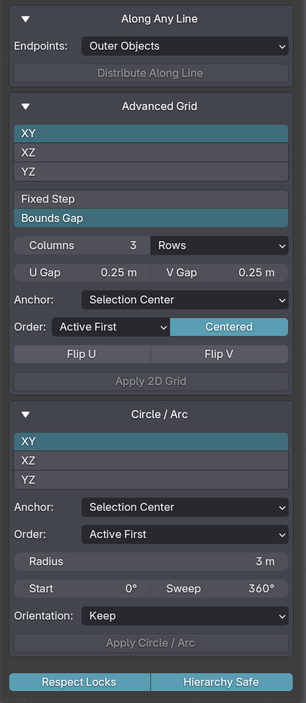 |

### Utility workflows — Complete edition

| Utility overview | Center & Ground, Quantize, and Origin to Bounds |
|---|---|
| 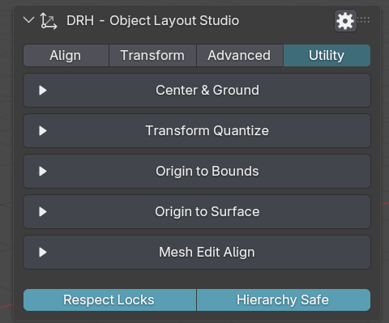 | 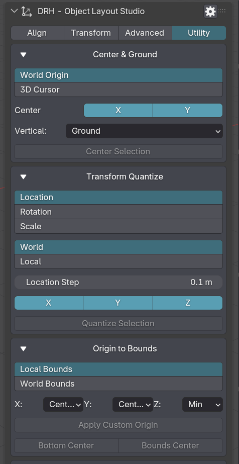 |
| Origin to Surface and Mesh Edit Align | Object context-menu integration |
| 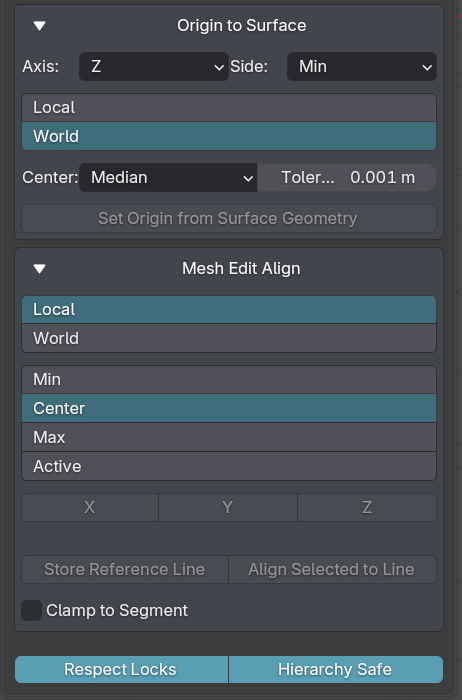 | 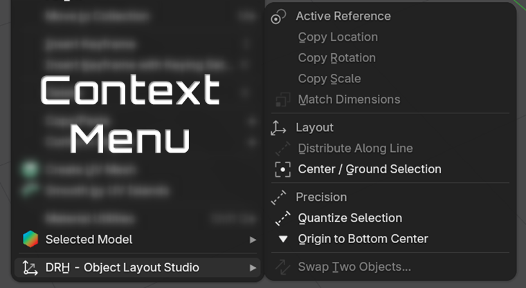 |

### Interface settings

  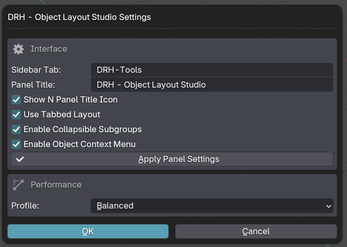

> Screenshots show the submitted 1.0.0 interface. Minor UI or packaging details may change during provider review.

---

## What DRH - Object Layout Studio does

DRH - Object Layout Studio helps you position and organize objects using explicit alignment, bounds, spacing, transform, view, geometry, registration, and surface rules.

It is designed for scene-layout and geometry workflows where repeatable object relationships matter more than manually adjusting each transform one object at a time.

Use it to:

- Align objects by origin or evaluated bounds.
- Align selected objects to the active object.
- Distribute objects by equal centers or true equal gaps.
- Arrange objects in 1D and 2D layouts.
- Move and rotate objects by exact values in local or world space.
- Match location, rotation, scale, and supported dimensions from the active object.
- Align objects relative to the current viewport.
- Auto-orient objects from mesh geometry.
- Align Point, Line, and Plane features.
- Register source and target geometry using captured point pairs.
- Refine object alignment with best-fit / ICP workflows.
- Drop selected objects onto an active mesh surface.
- Center, ground, quantize, and refine object origins.
- Use the Lite edition when only Align and Transform workflows are needed.

---

### Key features

- Precision origin and evaluated-bounds alignment.
- Active, selection, cursor, and world references.
- Equal-center and equal-gap distribution.
- Grid, line, circle, and arc arrangement workflows.
- Local and world transform controls.
- View-aware alignment and distribution.
- Geometry-driven Auto Orient.
- Point / Line / Plane feature alignment.
- Point-pair registration and best-fit refinement.
- Surface placement and grounding.
- Mesh Edit alignment helpers.
- Center & Ground and Transform Quantize.
- Configurable Sidebar Tab and Panel Title.
- Collapsible subgroup workflow.
- Object context-menu integration.
- Complete and Lite editions using one shared support repository.

---

  
<strong>🧩 Full feature list</strong>

## Full feature list

### Align

- Origin alignment.
- Evaluated bounds alignment.
- Active object reference.
- Selection reference.
- 3D Cursor reference.
- World reference.
- Minimum / Center / Maximum mapping.
- X / Y / Z alignment.
- Align to Active location.
- Align to Active rotation.
- Align to Active scale.
- 1D distribution.
- 2D grid distribution.
- Equal Centers.
- Equal Gaps.
- Swap transforms.
- Randomize transforms.

### Transform

- Separate / Arrange workflow.
- Fixed-step arrangement.
- Bounds-aware arrangement.
- Move by exact distance.
- Rotate by exact angle.
- Local transform space.
- World transform space.
- Respect transform locks.
- Hierarchy-safe transform handling.

### Advanced — Complete edition

- Active Reference.
- Along Any Line.
- Advanced Grid.
- Circle / Arc.
- View Align.
- Auto Orient.
- Surface-normal analysis.
- PCA-based orientation.
- Symmetry Assist.
- Point feature capture and alignment.
- Line feature capture and alignment.
- Plane feature capture and alignment.
- Arbitrary captured-line rotation.
- Directional slide.
- Geometric measurements.
- Point-pair registration.
- Best Fit / ICP.
- Drop to Active Surface.

### Utility — Complete edition

- Mesh Edit Align.
- Flatten selected geometry by axis.
- Store Reference Line.
- Project selected vertices to line.
- Origin to Surface.
- Center & Ground.
- Transform Quantize.
- Origin to Bounds.
- Bottom-center origin placement.
- Bounds-center origin placement.
- Match Active Dimensions.

### Lite edition

- Align.
- Align to Active.
- Distribution.
- Rearrangement.
- Separate / Arrange.
- Move.
- Rotate.
- No Advanced tools.
- No Utility tools.

---

## Who is it for?

DRH - Object Layout Studio is designed for:

- Blender modelers.
- Hard-surface artists.
- Environment artists.
- Product visualization artists.
- Architectural visualization users.
- Technical artists.
- Asset creators.
- Scene-layout artists.
- Users working with repeated object arrangements.
- Users who need precise transform matching.
- Users aligning geometry references or scans.
- Users who want a smaller Align + Transform-only edition.

---

## Current status

| Item | Details |
|---|---|
| **Status** | 🟡 Pending Review |
| **Current version** | 1.0.0 |
| **Minimum Blender version** | 4.2.0 |
| **Platforms** | Windows, macOS, Linux |
| **Release stage** | Submitted release candidate awaiting provider approval |
| **Editions** | Complete and Lite |
| **Distribution** | Blendkit after approval |
| **Support repository** | [DRH Object Layout Studio Support](https://github.com/pacosalasv/DRH_Object_Layout_Studio-Support) |

Both editions have been submitted for approval. The project is now presented as a release candidate under review rather than an early-development build.

Compatibility feedback, usability comments, performance observations, Complete/Lite workflow feedback, and documentation corrections remain welcome during review and after release.

---

## Feedback and compatibility reports

This repository remains open for public feedback while Complete and Lite are under provider review and after their public release.

Feedback is especially useful for:

- Alignment accuracy.
- Origin and bounds behavior.
- Distribution ordering.
- Equal-center and equal-gap workflows.
- Grid, line, circle, and arc arrangements.
- Move and Rotate workflows.
- View Align behavior.
- Auto Orient results.
- Point / Line / Plane feature alignment.
- Registration and best-fit behavior.
- Surface placement.
- High-density mesh performance.
- Complete vs Lite workflow expectations.
- Installation experience.
- Compatibility concerns.
- Documentation clarity.
- Provider delivery or listing issues after approval.

Useful feedback examples:

> “Equal Gaps should preserve this object ordering rule.”

> “View Align behaves differently in this viewport orientation.”

> “Auto Orient should prioritize this axis for this type of mesh.”

> “The Lite edition should keep this Align workflow.”

> “Best Fit takes too long on this mesh density.”

---

## Quick links

- [Support repository](https://github.com/pacosalasv/DRH_Object_Layout_Studio-Support)
- [Ask a question in Discussions](https://github.com/pacosalasv/DRH_Object_Layout_Studio-Support/discussions)
- [Open a new issue](https://github.com/pacosalasv/DRH_Object_Layout_Studio-Support/issues/new/choose)
- [Report a bug](https://github.com/pacosalasv/DRH_Object_Layout_Studio-Support/issues/new?template=bug_report.yml)
- [Request a feature](https://github.com/pacosalasv/DRH_Object_Layout_Studio-Support/issues/new?template=feature_request.yml)
- [Report a compatibility issue](https://github.com/pacosalasv/DRH_Object_Layout_Studio-Support/issues/new?template=compatibility_issue.yml)

---

## Before you post

Please include as much of the following information as possible:

- Edition: Complete or Lite.
- Add-on version.
- Blender version.
- Operating system.
- Installation method.
- Clear steps to reproduce.
- Expected result.
- Actual result.
- Error message, screenshot, or console output when available.

For compatibility or performance issues, please also include:

- Blender build type, if known.
- Portable or installed Blender version.
- Object Mode or Edit Mode.
- Object types involved.
- Selection and active-object state.
- Approximate mesh density for geometry-heavy workflows.
- Performance Profile when relevant.
- Whether the issue happens with a clean Blender configuration.

---

## Use Discussions for

- Questions.
- How-to topics.
- Installation help.
- Compatibility checks.
- FAQ.
- Suggestions.
- Release-review feedback.
- Complete vs Lite workflow feedback.
- Performance observations.
- Workflow ideas.

---

## Use Issues for

- Confirmed bugs.
- Reproducible compatibility problems.
- Alignment problems.
- Distribution problems.
- Transform workflow problems.
- Auto Orient problems.
- Feature alignment problems.
- Registration / best-fit problems.
- Surface workflow problems.
- Utility workflow problems.
- Feature requests.
- Regressions.
- Documentation errors.
- Provider or delivery problems after release.

---

## Where to post

Open a **Discussion** for:

- General questions.
- Setup help.
- Workflow advice.
- Suggestions.
- Review-stage feedback.

Open an **Issue** for:

- Confirmed bugs.
- Reproducible compatibility problems.
- Alignment, distribution, transform, geometry, registration, or utility failures.
- Regressions.
- Feature requests.
- Documentation problems.

---

## Support policy

This repository is a public support hub.

Do not post:

- Private account details.
- LICENSE keys.
- Payment information.
- Confidential production files.
- Private client files.
- Sensitive system information.

If a private file is required to reproduce an issue, please describe the problem first and wait for further instructions.

---

## Technical notes

This add-on is source based, with:

- No obfuscation.
- No binary-only content.
- No external services required for normal operation.
- No account requirements.

The Complete edition uses native Blender geometry, BMesh, KDTree, and BVH workflows where applicable.

The add-on is intended to work locally inside Blender.

---

## Availability

**DRH - Object Layout Studio Complete** and **DRH - Object Layout Studio Lite** have both been submitted and are currently awaiting provider approval.

Official installable releases will be distributed through **Blendkit after approval**. Until then, this GitHub repository remains the central public location for:

- Support.
- Documentation.
- Issue tracking.
- Compatibility reports.
- Public feedback.
- Release notes.

This repository does not serve as the official provider release-package download location.

---

## Documentation

- [User Manual](docs/manual/user-manual.pdf)
- [Changelog](CHANGELOG.md)
- [Support](SUPPORT.md)

---

## LICENSE

This repository is distributed under **GPL-3.0-or-later**.

---

### DRH Add-ons

**Blender tools, updates, and releases.**

Built for clean workflows, practical utilities, and production-friendly Blender setups.

